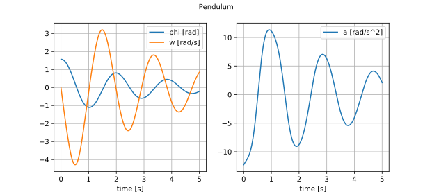
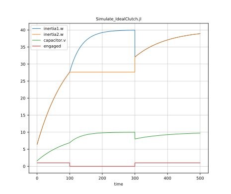

# Overview

## Mathematical Description

ModiaMath provides a simulation engine and other mathematical utilities 
to solve initial value problems of the following **implicit index 1 DAE
with events** (containing an ODE or a semi-explicit index 1 DAE as special cases;
``x(t), z(t)`` are real vectors):

```math
\begin{align}
     z &= f_z(x, t) \\
 0 = r &= \left[ \begin{array}{l}
                  M_d(x,t,z_i>0) \cdot \dot{x} + b_d(x,t,z_i>0) \;\;\; (= f_d)\\
                  f_c(x,t,z_i>0)
                 \end{array} \right] \\                 
 J &= \left[ \begin{array}{c}
               M_d \\  
               \frac{\partial f_c}{\partial x} 
             \end{array}\right] \;\; \text{is regular (matrix is invertible)}
\end{align}
```

where

```math
\lim_{\epsilon \rightarrow 0} x(t_0 - \epsilon) = x_0^{-}
```

is given. Note, that it is assumed that equations ``f_d`` are linear in the derivatives ``\dot{x}``.
Equations ``z=z(t)`` are zero-crossing functions. Whenever a ``z_i(t)`` crosses zero, 
integration is halted, the DAE equations ``f_d, f_c`` might be changed and afterwards integration is restarted. 
At an event instant some ``f_c`` equations might become ``f_d`` equations and vice versa.
If the Jacobian ``J`` is **regular**, the DAE has an index 1 (= by differentiating ``f_c`` once,
the system can be transformed to an ODE).

ModiaMath assumes that ``J`` is **regular** for all time instants.
If this condition is violated, initialization and simulation will usually fail and an error message of the
form *"Solver does not converge"* might appear. Note, ModiaMath does not check this condition and can therefore
not provide better diagnostics in such cases.

Initial conditions ``x_{ev}^{-}`` must be provided before simulation can start (``x_{ev}^{-} = x_0^{-}``) or at
an event restart. They need 
**not** to fulfill the constraint equations, so ``f_c (x_{ev}^{-},t_{ev} )≠0`` is allowed.
If this is the case, initialization/re-initialization will simulate for an infinitesimal small time instant 
so that ``x_{ev}^{-}`` changes discontinuously to ``x_{ev}^{+}`` with ``f_c (x_{ev}^{+},t_{ev} )=0``. 
This is performed by *analytically* integrating over the initial time or the event time and
might imply to integrate over Dirac impulses (in case ``x`` is discontinuous at this time instant).
Under certain conditions (for details see [^3], section 4.2) a numerical approximation of the
mathematical (exact) solution is computed, using the new method proposed in [^3] (equation 8 in section 4.2).

As shown in [^1], **any** DAE can be transformed to the form above with ``f_d`` nonlinear in
``\dot{x}``, at least in principal.
In [^2] algorithms are proposed to automatically transform a large class of DAEs to this
form **without solving algebraic equations and retaining the sparsity of the equations**. 
This may require to analytically differentiating equations. The algorithms of this paper are
implemented in the Julia package [Modia](https://github.com/ModiaSim/Modia.jl/) which in turn uses
[ModiaMath](https://github.com/ModiaSim/ModiaMath.jl/).
In [Modia3D](https://github.com/ModiaSim/Modia3D.jl) the transformation to this form is built into the package itself.
Since all balance equations in physics and chemistry (such as energy balance, momentum 
balance) are linear in the highest derivatives,
DAEs describing real world systems are linear in ``\dot{x}`` and
therefore this slight restriction is assumed and utilized by ModiaMath. 

Note, DAE (1)-(3) could be further transformed to an ODE (``\dot{x} = f(x,t)``), but
then the evaluation of function ``f(x,t)`` might require to solve local linear and/or
nonlinear equation systems. Furthermore, there are systems 
(for example ModiaMath/examples/Simulate_FreeBodyRotation.jl) where the
ODE states ``x`` would then need to be dynamically changed during simulation.

It is highly recommended to use [Modia](https://github.com/ModiaSim/Modia.jl/) or 
[Modia3D](https://github.com/ModiaSim/Modia3D.jl) for simulating DAEs because this is
much simpler and less error prone as when utilizing ModiaMath directly.
However, ModiaMath can be also used without Modia or Modia3D. In this case, basically
one Julia function with the following interface has to be provided
(and in this function specific utility functions can be called)

```julia
getModelResidues(m::AbstractSimulationModel, t::Float64, x::Vector{Float64},  
                 der_x::Vector{Float64}, r::Vector{Float64}
```

where `r` is the vector of residues (``r = \left[ f_d; f_c \right]``). Given the 
simulation model `m` (= a mutable struct), the actual time instant `t`, the DAE variables
`x(t)` and their derivatives `der_x(t)`, the function has to compute the residue vector `r(t)`.
In directory ModiaMath/examples/withoutMacros_withoutVariables several examples are present
that are based on this interface.

In order to simplify the definition of direct ModiaMath models (to evaluate and test ModiaMath 
functionality), the macro [`@component`](@ref) has been introduced.
The examples in directory ModiaMath/examples/xxx.jl use this model definition.
In directory ModiaMath/examples/withoutMacros/xxx.jl the same examples are present,
however, the macro has been manually expanded (to show and test the result of the macro).
The [`@component`](@ref) does not yet support events. If events are present in a model,
the model has to be defined as shown in the examples of directory
ModiaMath/examples/withoutMacros_withoutVariables.

[^1]: K.E. Brenan, S.L. Campbell, and L.R. Petzold (1996):
      [Numerical Solution of Initial Value Problems in
      Differential-Algebraic Equations](http://bookstore.siam.org/cl14/). SIAM.

[^2]: M. Otter, H. Elmqvist (2017): [Transformation of Differential Algebraic Array Equations
      to Index One Form](http://www.ep.liu.se/ecp/132/064/ecp17132565.pdf). 
      12th International Modelica Conference. 

[^3]: A. Benveniste, B. Caillaud, H. Elmqvist, J. Ghorbal, M. Otter, M. Pouzet (2019):
      *Multi-Mode DAE Models - Challenges, Theory and Implementation*.
      Computing and Software Science, 
      [LNCS 10000](https://www.springer.com/us/book/9783319919072), 
      Editors: B. Steffen and G. Woeginger, Springer.
     


## Getting Started

You can just past the following code fragments into the Julia REPL.


### To define a model
(note, it is simpler and less error prone to define a model with Modia or Modia3D):

```julia
  using ModiaMath
  using StaticArrays

  @component Pendulum(;L=1.0, m=1.0, d=0.1, g=9.81) begin
     phi = RealScalar(start=pi/2, unit="rad"    , fixed=true,               numericType=ModiaMath.XD_EXP)
     w   = RealScalar(start=0.0 , unit="rad/s"  , fixed=true, integral=phi, numericType=ModiaMath.XD_EXP)
     a   = RealScalar(            unit="rad/s^2",             integral=w  , numericType=ModiaMath.DER_XD_EXP) 
     r   = RealSVector{2}(        unit="m"      ,                           numericType=ModiaMath.WC)
  end;

  function ModiaMath.computeVariables!(p::Pendulum, sim::ModiaMath.SimulationState)  
     L = p.L; m = p.m; d = p.d; g = p.g; phi = p.phi.value; w = p.w.value
   
     p.a.value = (-m*g*L*sin(phi) - d*w) / (m*L^2)

     if ModiaMath.isStoreResult(sim)
        p.r.value = @SVector [L*sin(phi), -L*cos(phi)]
     end
  end;

  simulationModel = ModiaMath.SimulationModel(Pendulum(L=0.8, m=0.5, d=0.2), stopTime=5.0);
   
```


### To simulate a model and plot results:

```julia
  result = ModiaMath.simulate!(simulationModel; log=true);
  ModiaMath.plot(result, [(:phi, :w) :a])
```

This results in:

```@raw html

```


### To run examples and tests:

```julia
# run examples
import ModiaMath
include("$(ModiaMath.path)/examples/Simulate_Pendulum.jl")         # ODE as index-0 DAE
include("$(ModiaMath.path)/examples/Simulate_FreeBodyRotation.jl") # index-1 DAE
include("$(ModiaMath.path)/examples/withoutMacros_withoutVariables/Simulate_PendulumDAE.jl") # index-3 DAE
include("$(ModiaMath.path)/examples/withoutMacros_withoutVariables/Simulate_SimpleStateEvents.jl")
include("$(ModiaMath.path)/examples/withoutMacros_withoutVariables/Simulate_BouncingBall.jl")

# run all tests
include("$(ModiaMath.path)/test/runtests.jl")
  
```

### To run a multi-mode example that has Dirac impulses

The following model from [^3]

```@raw html

```

is defined by an ideal clutch described by two modes: *Released* (the clutch shafts rotate freely)
and *Engaged* (the clutch shafts are rigidly fixed). If variable `engaged = true`, the clutch
is in mode *Engaged* and otherwise in mode *Released*. An event occurs when Boolean variable
`engaged` changes its value. If the clutch is in mode *Released* and changes to *Engaged* a
Dirac impulse occurs (the clutch torque becomes infinite) and changes the clutch shaft speeds
 (`inertia1.w, inertia2.w`) in such a way that they coincide. Since `inertia1.w` is algebraically
 coupled to `capacitor.v` (the voltage over the capacitor) via the `emf` element, also 
 `capacitor.v` changes discontinuously and `der(capacitor.v)` is a Dirac impulse.
 Mathematically, this means that the DAE index is changing depending on the clutch state
 and an  ``f_c`` equation is changed to an ``f_d`` equation and vice versa. 

 This model can be simulated and the result plotted with command:

```julia
import ModiaMath
include("$(ModiaMath.path)/examples/withoutMacros_withoutVariables/Simulate_IdealClutch.jl")
  
```

```@raw html

```

The results of the simulation are shown in the figure above. The initial speed of
inertia1 is w1 = 0 rad/s and w2 = 10 rad/s for inertia2. The capacitor is initially uncharged.
The upper two partly overlapping curves are the angular velocities of inertia1
and inertia2. When the clutch is disengaged, the angular velocity of inertia2 is
constant. The green curve shows the voltage over the capacitor. Since the clutch
is engaged at initialization, Dirac impulses occur at time = 0 s. As a result, after
initialization the angular velocities of the two inertias are identical. The common
angular velocity at time = 0 s is 6.4 rad/s. The reason is that the capacitor acts
in the same way as an additional
moment of inertia to inertia1. The effective inertia is 

```math
J_{eff} = J1 + J2 + k^2 C = 0.1 + 0.4 + 0.25^2 \cdot 2 = 0.625
```

Thus, the common angular velocity for the two inertias at time=0 s becomes 

```math
\begin{align}
w^{+}_0 &= (J1 \cdot w1^{-}_0 + J2 \cdot w2^{-}_0 + k \cdot C \cdot v^{-}_0)/J_{eff} \\
        &= (0.1\cdot0 + 0.4\cdot10 + 0.25\cdot2\cdot0)/0.625 = 6.4 \text{ rad/s.}
\end{align}
```        

There are no Dirac impulses at time = 100 s when the clutch disengages, but
again Dirac impulses at time = 300 s when the clutch engages again.


## Package structure

The ModiaMath package is structured in the a set of sub-modules. The most important ones are:

- [`ModiaMath.SimulationEngine`](@ref)\
  The engine to simulate implicit index 1 DAEs with events.

- [`ModiaMath.DAE`](@ref)\
  Interface between the SimulationEngine and the index 1 DAE model
  (e.g. initialization and event iteration is performed here).

- [`ModiaMath.Result`](@ref)\
  The `plot` function of this module allows to plot the result data of the simulation engine
  by giving the signal names. With tuples and/or vectors/matrices of signal names, the window
  layout of the figures is defined. The legends/labels of the plots are automatically constructed by
  the signal names and their units.

- [`ModiaMath.Variables`](@ref)\
  Provides Variable types to define properties of the variables on a higher level and copy
  automatically the interface vectors from the integrator into the variables and vice versa.

- [`ModiaMath.Frames`](@ref)\
  Functions that generate and operate on frames, that is coordinate systems in 3D.
  The orientation of a frame is described either with a 3x3 rotation matrix or with a 
  quaternion vector. This module is currently mainly used from Modia3D, but the functionality
  is useful for all 3D programs.


